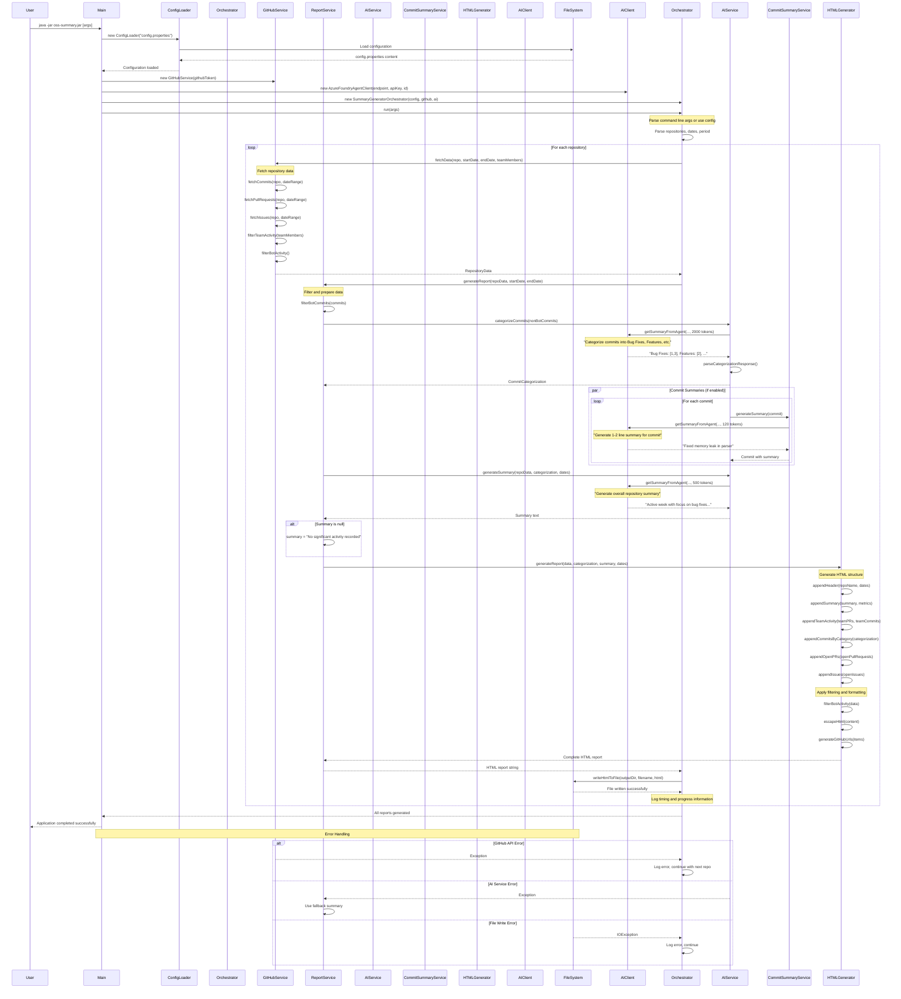

```mermaid
sequenceDiagram
    participant User
    participant Main
    participant ConfigLoader
    participant SummaryGeneratorOrchestrator as Orchestrator
    participant GitHubService
    participant ReportService
    participant AzureAiAnalysisService as AIService
    participant ParallelCommitSummaryService as CommitSummaryService
    participant HtmlReportGenerator as HTMLGenerator
    participant AzureFoundryAgentClient as AIClient
    participant FileSystem

    %% Application Initialization
    User->>Main: java -jar oss-summary.jar [args]
    Main->>ConfigLoader: new ConfigLoader("config.properties")
    ConfigLoader->>FileSystem: Load configuration
    FileSystem-->>ConfigLoader: config.properties content
    ConfigLoader-->>Main: Configuration loaded
    
    Main->>GitHubService: new GitHubService(githubToken)
    Main->>AIClient: new AzureFoundryAgentClient(endpoint, apiKey, id)
    Main->>Orchestrator: new SummaryGeneratorOrchestrator(config, github, ai)
    
    %% Main Orchestration Flow
    Main->>Orchestrator: run(args)
    
    Note over Orchestrator: Parse command line args or use config
    Orchestrator->>Orchestrator: Parse repositories, dates, period
    
    %% GitHub Data Fetching Phase
    loop For each repository
        Orchestrator->>GitHubService: fetchData(repo, startDate, endDate, teamMembers)
        
        Note over GitHubService: Fetch repository data
        GitHubService->>GitHubService: fetchCommits(repo, dateRange)
        GitHubService->>GitHubService: fetchPullRequests(repo, dateRange)
        GitHubService->>GitHubService: fetchIssues(repo, dateRange)
        GitHubService->>GitHubService: filterTeamActivity(teamMembers)
        GitHubService->>GitHubService: filterBotActivity()
        
        GitHubService-->>Orchestrator: RepositoryData
        
        %% Report Generation Phase
        Orchestrator->>ReportService: generateReport(repoData, startDate, endDate)
        
        Note over ReportService: Filter and prepare data
        ReportService->>ReportService: filterBotCommits(commits)
        
        %% AI Analysis Phase
        ReportService->>AIService: categorizeCommits(nonBotCommits)
        AIService->>AIClient: getSummaryFromAgent(..., 2000 tokens)
        Note over AIClient: "Categorize commits into Bug Fixes, Features, etc."
        AIClient-->>AIService: "Bug Fixes: [1,3], Features: [2], ..."
        AIService->>AIService: parseCategorizationResponse()
        AIService-->>ReportService: CommitCategorization
        
        %% Parallel Commit Summary Generation
        par Commit Summaries (if enabled)
            loop For each commit
                AIService->>CommitSummaryService: generateSummary(commit)
                CommitSummaryService->>AIClient: getSummaryFromAgent(..., 120 tokens)
                Note over AIClient: "Generate 1-2 line summary for commit"
                AIClient-->>CommitSummaryService: "Fixed memory leak in parser"
                CommitSummaryService-->>AIService: Commit with summary
            end
        end
        
        %% Overall Summary Generation
        ReportService->>AIService: generateSummary(repoData, categorization, dates)
        AIService->>AIClient: getSummaryFromAgent(..., 500 tokens)
        Note over AIClient: "Generate overall repository summary"
        AIClient-->>AIService: "Active week with focus on bug fixes..."
        AIService-->>ReportService: Summary text
        
        %% Handle null summary case
        alt Summary is null
            ReportService->>ReportService: summary = "No significant activity recorded"
        end
        
        %% HTML Generation Phase
        ReportService->>HTMLGenerator: generateReport(data, categorization, summary, dates)
        
        Note over HTMLGenerator: Generate HTML structure
        HTMLGenerator->>HTMLGenerator: appendHeader(repoName, dates)
        HTMLGenerator->>HTMLGenerator: appendSummary(summary, metrics)
        HTMLGenerator->>HTMLGenerator: appendTeamActivity(teamPRs, teamCommits)
        HTMLGenerator->>HTMLGenerator: appendCommitsByCategory(categorization)
        HTMLGenerator->>HTMLGenerator: appendOpenPRs(openPullRequests)
        HTMLGenerator->>HTMLGenerator: appendIssues(openIssues)
        
        Note over HTMLGenerator: Apply filtering and formatting
        HTMLGenerator->>HTMLGenerator: filterBotActivity(data)
        HTMLGenerator->>HTMLGenerator: escapeHtml(content)
        HTMLGenerator->>HTMLGenerator: generateGitHubUrls(items)
        
        HTMLGenerator-->>ReportService: Complete HTML report
        ReportService-->>Orchestrator: HTML report string
        
        %% File Output Phase
        Orchestrator->>FileSystem: writeHtmlToFile(outputDir, filename, html)
        FileSystem-->>Orchestrator: File written successfully
        
        Note over Orchestrator: Log timing and progress information
    end
    
    Orchestrator-->>Main: All reports generated
    Main-->>User: Application completed successfully

    %% Error Handling Flows
    Note over Main,FileSystem: Error Handling
    alt GitHub API Error
        GitHubService-->>Orchestrator: Exception
        Orchestrator->>Orchestrator: Log error, continue with next repo
    else AI Service Error
        AIService-->>ReportService: Exception
        ReportService->>ReportService: Use fallback summary
    else File Write Error
        FileSystem-->>Orchestrator: IOException
        Orchestrator->>Orchestrator: Log error, continue
    end
```
